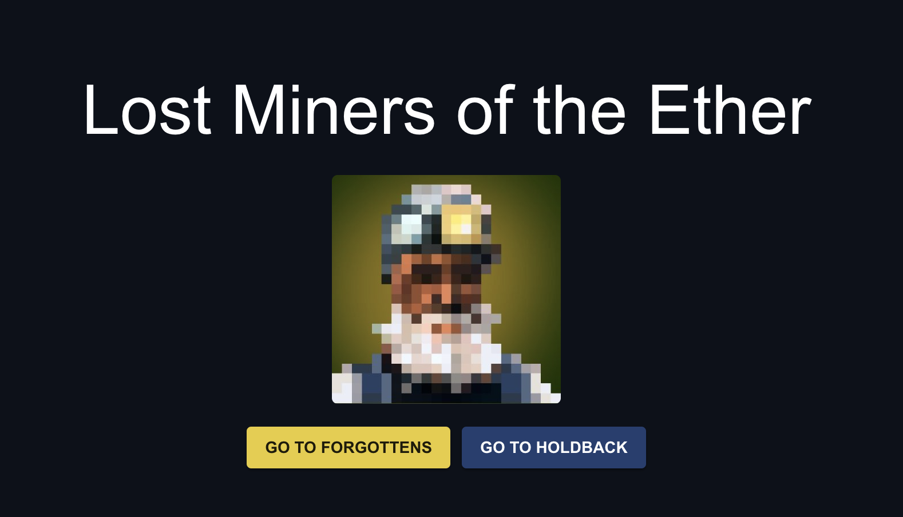
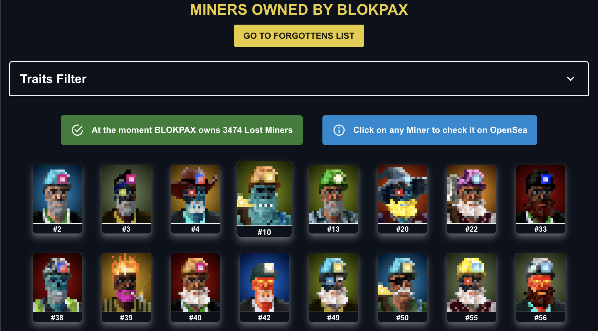
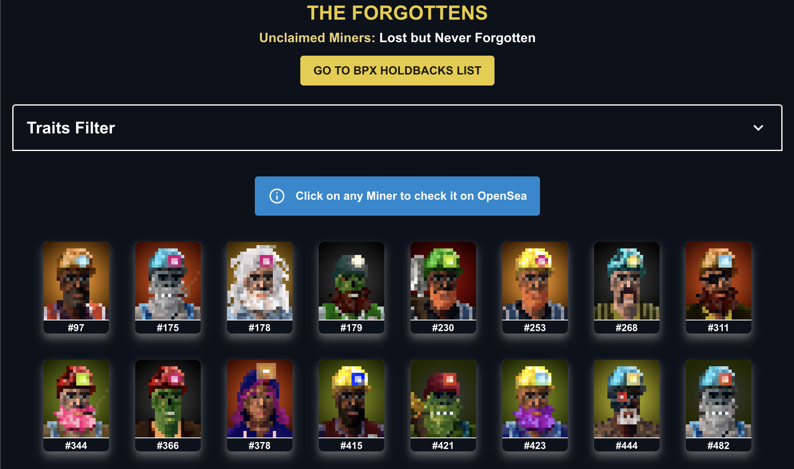
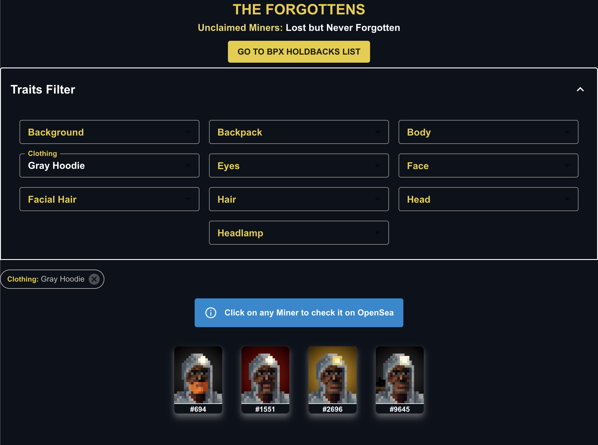

# LOST MINERS HOLDBACKS AND FORGOTTENS

This repository includes:

- A NextJS app that hosts the actual Lost Miners Holdbacks and Forgottens pages
- A [listener script](lost-miners-next/holdbacks/listener.js) that listens onchain data in real time to update the holdbacks list

## Whats needed

### an EVM endpoint like Infura

In order to listen for onchain data, The [listener script](lost-miners-next/holdbacks/listener.js) needs to connect to an EVM endpoint. I recomend using Infura and set the websocket endpoint into an env var called `EVM_ENDPOINT`

### MongoDB

As BPX owns about 3500 different wallets where Holdbacks miners are stored, then we need a way to track those holdbacks as requesting those 3500 wallets on runtime is impossible because of the amount of wallets.

Thats why we use MongoDB to store the holdbacks list and everytime the listener script intercept a new transfer from any BPX wallet, it updates MongoDB to be in sync.

We need the following env variables so the NextJS app can pull the holdbacks list:

- `MONGO_ENDPOINT`: MongoDB endpoint, **I suggest using MongoDB Atlas Free tier**
- `MONGO_DB_NAME`: The name of the mongo database on the cluster we're connected to
- `MONGO_COLLECTION` The name of the collection where to store the list of holdbakcs miners

### To notice about the NextJS App

To improve performance, a caching solution was implemented on 2 sides so users don't have to wait too much for the holdbacks list to load:

- Caching holdbacks list on the API side: [miners.js](lost-miners-next/src/pages/api/miners.js) is using the library `memory-cache` to cache the list of holdbacks for 5 minutes. This prevent unncessary calls to MongoDB if multiple clients are requesting the holdbacks list at the same time.

- Caching holdbacks list client side: [holdbacks.jsx](lost-miners-next/src/pages/holdbacks.jsx) implements an useEffect hook to call the Miners API to fetch the list of holdbacks. However, it will cache that list on the browser for 5 minutes so it prevents unncessary calls to the API in case the user refreshes the page and etc.

each cache TTL can be configured on both the API and useEffect hook.

### About the holdbacks directory

That directory holds the [listener script](lost-miners-next/holdbacks/listener.js) that will listen for real time on chain data and update MongoDB accordingly.

However, The MongDB has to be first initialized with the current BPX owned miners snapshot, thats why there's another util script [initializeMongo.js](lost-miners-next/holdbacks/initializeMongo.js) that receives this snapshot and populates MongoDB with those miners that are currently owned by BPX. The holdbacks snapshot can be taken using the [takeSnapshot.js](lost-miners-next/holdbacks/takeSnapshot.js) script. Both of these scripts should be ran once as after that the **listener script should keep mongodb in sync**.

### How to run it

- `npm run dev`: To run it on your local machine
- `npm start`: To run it on a prod environment

Both scripts will start the listener script and the NextJS app

## Home page example

## Holdbacks page example

## Forgottens page example

## Trait Filter example

